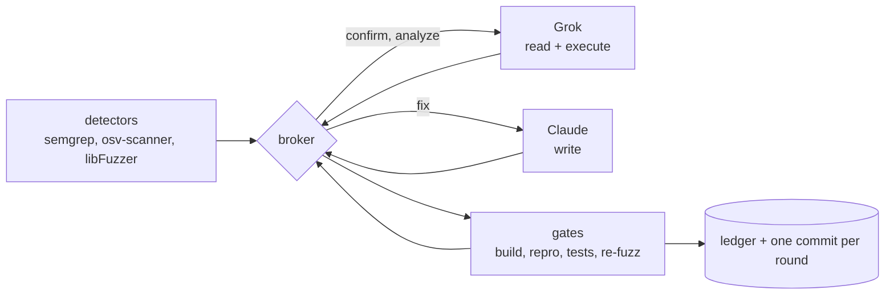

# crossfire

crossfire points two ACP coding agents at a target repository and keeps every decision in code: deterministic detectors find the bugs, Grok reasons over them, Claude patches, and no fix counts until the broker re-runs the repro itself and watches the exit code flip.


[Requirements](#requirements) | [Quick start](#quick-start) | [Usage](#usage) | [What it does](#what-it-does) | [Architecture](#architecture) | [Docs](docs/README.md)

## Requirements

- Node 20 or newer, and `git`.
- A target that is its own git repository, since every round commits into it.
- For the detectors: [semgrep](https://semgrep.dev), [osv-scanner](https://github.com/google/osv-scanner), and a fuzz harness built for libFuzzer.
- For the agents: the `claude` and `grok` CLIs, installed and logged in.

Only Node and git are needed for a `--dry-run`. Platform notes and the full install path are in [docs/installation.md](docs/installation.md).

## Quick start

```sh
git clone git@github.com:moonrunnerkc/crossfire.git
cd crossfire
npm install && npm run check
```

`npm run check` is types, lint, and the suite. It ends with:

```text
 Test Files  15 passed | 2 skipped (17)
      Tests  285 passed | 3 skipped (288)
```

Then `npm run build` writes `dist/`, and the CLI runs as `node dist/cli.js`. The two skipped files are the smoke and integration runs, which need the real agents.

## Usage

Exercise the whole loop with no scanners, no compiler, and no models. Everything except the detectors and the agents runs for real:

```sh
node dist/cli.js run --config crossfire.json --dry-run --run-dir runs/dry
```

```text
round 1
  detected 1 finding(s) from semgrep:ok
  candidate-confirmation -> grok in 0s
  candidate dry-run-finding confirmed
  fix -> claude in 0s
  1 fix(es) reported
  verify 1 closed
  tests pass
  re-fuzz found 0 new
  committed 77dab6b67f
crossfire: clean after 1 round(s)
```

A real run, against the config that describes the target, its detectors, and the iteration cap:

```sh
node dist/cli.js run --config crossfire.json
```

Verify a finished run's hash chain and print it. Exit is non-zero if the chain is broken:

```sh
node dist/cli.js export --ledger runs/2026-08-15T10-00-00-000Z/ledger.jsonl
```

Every flag, every config field, and worked examples: [docs/usage.md](docs/usage.md).

## What it does

- Runs Semgrep, OSV-Scanner, and libFuzzer against the configured scope, then collapses what they report into one deduplicated set of findings keyed on the bug rather than on the tool that saw it.
- Sends scanner candidates to Grok, which either dismisses one or hands back a repro command. The broker runs that command before the candidate is allowed anywhere near a fix.
- Routes fixes to Claude, the only agent with write access. Grok gets read and execute, enforced in the ACP permission and filesystem handlers rather than asked for in prompt text.
- Judges every fix on one thing: the repro exits 0 or it does not.
- Rebuilds between the patch and the checks, so a round never grades the previous binary.
- Re-fuzzes the patched build for a bounded budget, which catches both a bug adjacent to the patch and a crash the fix failed to close.
- Writes one hash-chained ledger entry and one git commit per round, empty rounds included, so a gap cannot be confused with a round somebody removed.
- Stops for four reasons: nothing survived a full pass, the iteration cap, a test regression, or a manual abort.

## Architecture



The split is the point. Detection is mechanical, so a model can never be the reason a bug is considered real; the broker holds routing and termination, so a model can never talk the loop into another round or out of one. Agent calls are stateless from our side: each turn gets the current findings and the diff, never an accumulated transcript. The reasoning behind each seam is in [docs/architecture.md](docs/architecture.md).

## Docs

[Docs index](docs/README.md) covers [installation](docs/installation.md), [usage and configuration](docs/usage.md), [architecture](docs/architecture.md), and [troubleshooting](docs/troubleshooting.md). Working on crossfire itself: [CONTRIBUTING.md](CONTRIBUTING.md).

## License

<!-- TODO: no LICENSE file and no `license` field in package.json, which is `private: true`. Which license should ship with this repo, or is it deliberately unlicensed? -->
Not yet declared.
