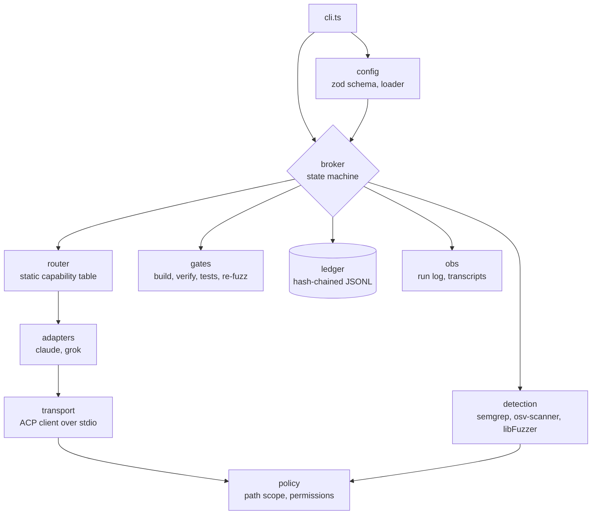
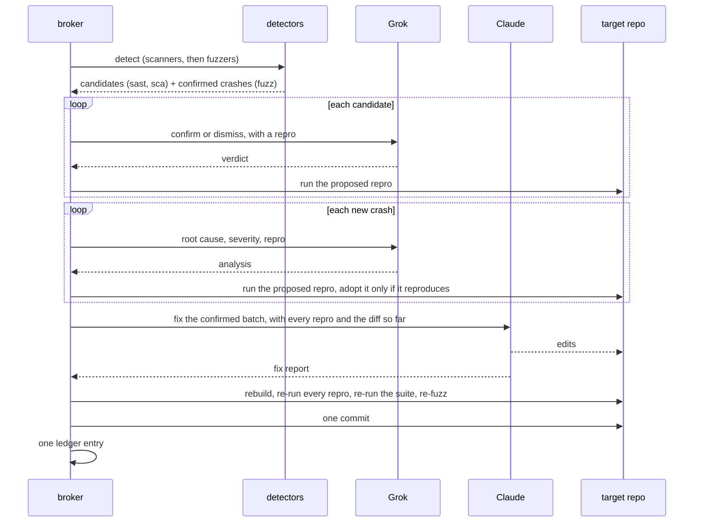

# Architecture

crossfire is a state machine with two models bolted to the side of it. Everything that decides something lives in `src/broker/state-machine.ts`; everything else either produces evidence for it or records what it did.

## Components

| Directory | Owns |
| --- | --- |
| `config/` | The run config schema and loader. Fails closed on anything it doesn't recognize. |
| `contracts/` | zod schemas for findings, analyses, fix reports, ledger entries, and normalized agent events. Nothing crosses a boundary without one. |
| `detection/` | Scanner and fuzzer runners, crash parsing, minimization, corpus handling, and finding identity. |
| `transport/` | The ACP client wrapper, the JSON-RPC tap, and the client-side handlers. |
| `adapters/` | How each agent process is launched, and nothing else. |
| `router/` | The static subtask-to-agent table. |
| `policy/` | Path scoping, the secret matcher, and per-agent permissions. |
| `gates/` | Build, verify, test regression, and the post-fix re-fuzz cross-check. |
| `broker/` | The loop, the prompt templates, the git integration, and the dry-run stubs. |
| `ledger/` | The hash-chained writer and the chain verifier. |
| `obs/` | The run log and the per-agent transcripts. Nothing in the loop reads them back. |

The only sanctioned extension points are `FuzzEngine`, `Scanner`, and `AgentHandle`. A second fuzz engine or a third agent slots in behind one of those; anything else is a change to the loop.

## A round

The order isn't arbitrary. Scanners run before fuzzers so a round's findings hash doesn't depend on process scheduling. The rebuild sits between the fix and every check that judges it, because a repro replays a binary and the fuzzer fuzzes one. The re-fuzz runs last and only when the round actually patched something, since its whole purpose is to walk the patched build.

Findings carry across rounds: a carried finding wins over a fresh copy of itself, because it holds the confirmed state and the repro established earlier. A crash the re-fuzz pass turns up that isn't already open enters the next round confirmed, since the fuzzer just reproduced it and needs nobody to vouch for it.

## Decisions, and what they cost

**The broker owns control flow.** No prompt asks a model what to do next, which agent should take something, or whether the loop continues. Routing is a static table; termination is four mechanical conditions. The cost is that crossfire can't adapt its strategy to a target: adding a new kind of work is a code change, not a prompt change. That's the trade being made deliberately, because a loop a model can talk into another round is a loop with no upper bound on cost or scope.

**Detectors find; models confirm.** A model is never the primary detector and never the sole judge of whether a bug is real. The cost is that crossfire is blind to bug classes no detector models. The cold hunt pass is the hedge, and it's off by default and structurally demoted: what it raises is a candidate, the broker assigns the id, and it buys its way into a fix round with a repro the broker ran.

**One exit code decides everything.** A finding survives if and only if its repro exits 0. The cost is that a run is exactly as good as its repros, and a lazily written repro can close a bug that's still there. The mitigation is that repros are executed before they're adopted: the broker runs Grok's proposed command and keeps the detector's original unless the proposal actually reproduces. Anything that can't run to completion is inconclusive rather than a pass.

**Agent turns are stateless.** Every turn opens a fresh ACP session and receives the current findings plus the diff of what earlier rounds changed. The cost is tokens: context is re-sent every turn. The gain is that a round's behavior is a function of its inputs, so nothing accumulates that isn't in the ledger or the diff.

**Scoping is enforced in the handlers, not in the prompt.** Grok's lack of write access is a table in `policy/permissions.ts` and a refusal in the ACP filesystem and permission handlers. An agent can't be argued out of a handler that refuses. The known limit: Claude's write scope is the repository minus the exclusion set, not `inScopeDirs`. The fix prompt asks it to stay inside them, and that ask isn't yet enforcement.

**Every round commits and appends, even an empty one.** The cost is empty commits in the target's history. The gain is that a gap in either sequence can't be confused with a round somebody removed, which is the property the ledger exists to provide.

**Fuzzing is bounded and seeded.** The seed is fixed at 1 so a run is reproducible, the budget is split across harnesses, and the post-fix cross-check gets 60s rather than a detection pass. The cost is shallower coverage than an unbounded campaign. crossfire is a repair loop, not a fuzzing rig; the deep campaign belongs upstream, and its crashes arrive here as a corpus.

**The engine seam exists ahead of its second implementation.** `FuzzEngine` is an interface with one adapter, libFuzzer, and the config schema accepts three engines that have none. That's a deliberate inconsistency: a harness configured for `jazzer` produces a detector run that says so rather than a schema error, which keeps the config honest about intent while the adapter is missing.

## Two implementation notes worth knowing

Subprocesses are spawned detached so the whole process group can be killed at the deadline. execa's own timeout signals only the process it spawned, and a test command or repro that does its work in a child leaves that child holding the pipes open. Measured at 5s of wall clock against a 250ms budget, which turns a bounded gate into a wait with no ceiling.

An agent turn is a stream of thinking followed by an answer, so the answer is the last well-formed JSON object in the text. An earlier object is never substituted for a final one the schema rejects. The risk being avoided is acting on a verdict the agent revised rather than the one it settled on.
